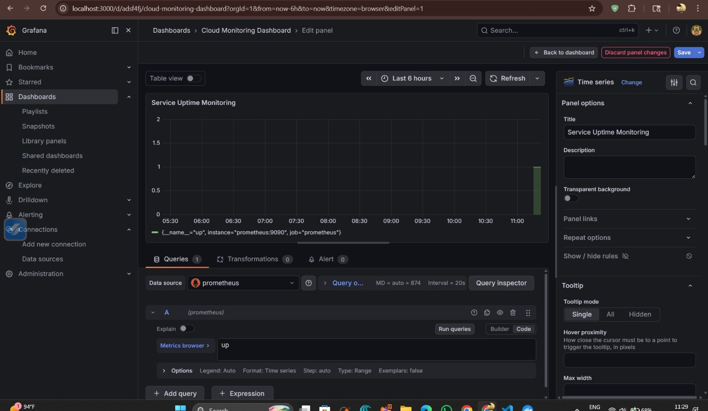

\# Cloud Monitoring Dashboard

Cloud Infrastructure Monitoring Dashboard

Real-time cloud observability and monitoring dashboard built using Prometheus, Grafana, Docker, and AWS CloudWatch to track infrastructure health, uptime, and system performance metrics.

Features
Real-time monitoring of CPU, memory, disk, and uptime metrics
Prometheus metric scraping and data collection
Interactive Grafana dashboards for visualization
Alert rules for threshold breaches (CPU, memory, disk)
Infrastructure observability for proactive issue detection
Cloud monitoring concepts using AWS CloudWatch
Tech Stack
Python
Prometheus
Grafana
Docker
AWS CloudWatch
Project Architecture
Prometheus collects metrics from monitored services
Grafana visualizes metrics through dashboards
Docker containerizes monitoring services
CloudWatch supports native cloud resource monitoring
Run Project

docker compose up

Access
Grafana: http://localhost:3000
Prometheus: http://localhost:9090
Default Login

admin / admin

Use Cases
Infrastructure health monitoring
Service uptime tracking
Alerting and incident response
Cloud observability learning project

